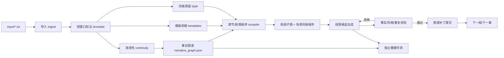

# 软件设计规格（SDS）

**项目：** PlotWeaver  
**设计原则：** 证据优先、单一事实底座、生成与评测隔离、风格与题材分离、可恢复批处理。

## 1. 总体架构



## 2. 目录与模块边界

| 模块 | 当前职责 | 主要产物 |
|---|---|---|
| `ingest.py` | 从 `input/` 导入作品、建立元数据与原文快照 | `source_manifest.json`、章节文本 |
| `annotate.py` | 切窗、严格 JSON 标注、密度/覆盖质量门控 | `chapter_annotations.*.json` |
| `continuity.py` | 跨章实体别名、状态连续性和关系检查 | `work_continuity.*.json` |
| `narrative_graph.py` | 构建唯一的静态事实图谱 | `narrative_graph.json` |
| `template_mining.py` | 提取匿名的宏观/事件/场景模板 | `template_library.json` |
| `style_distillation.py` | 提取现有基础风格画像与卡片 | `style_profile.json`、`style_cards.json` |
| `scene_compiler.py` | 图谱映射到章—场景—节拍—段落程序 | `chapter_program*.json` |
| `graph_runtime.py` | 按段检索最小子图、维护已提交运行时状态 | 子图、补丁验证结果 |
| `scene_generation.py` | 分段生成、修复、写出候选补丁 | `generated_draft.txt`、`chapter_graph_patch.*.json` |
| `program_sequence.py` | 串行控制多章，阻止未提交状态泄漏 | `sequence_summary.json` |
| `program_fidelity.py` | 原章对照的独立结构/风格回归评测 | `fidelity_report.json` |

`v2/` 是隔离的历史参考目录，当前 V3 模块不得导入它。任何新功能必须写入现有 V3 模块或新建 V3 模块，不能重新引入旧十三步流程。

## 3. 数据层与版本策略

### 3.1 产物位置

```text
input/                                  # 当前导入源
novels/                                 # 小说档案，不自动处理
corpus/<作者标识>/<作品标识>/             # 静态语料与图谱产物
runs/<作者标识>/<运行标识>/               # 计划、生成、日志与评测
output/<作者标识>_skill/                 # 可交付的 Skill 包
```

### 3.2 所有可复用产物的信封

```json
{
  "schema_version": "4.0",
  "extractor_version": "annotator-v4",
  "quality_policy_version": "quality-v4",
  "source_sha256": "...",
  "created_at": "2026-07-27T00:00:00Z",
  "payload": {}
}
```

`schema_version`、`extractor_version`、`quality_policy_version` 或 `source_sha256` 任一不匹配时，调用方必须拒绝复用该产物。旧产物先归档到作品目录内的 `archive/`，只在新链路通过验收后才允许清理。

## 4. 叙事图谱设计

### 4.1 节点

| 节点 | 关键属性 |
|---|---|
| `entity` | 类型、规范名、别名、合并置信度、证据 |
| `event` | 主体、动作、结果、章节/段落顺序、参与者 |
| `fact` | 谓词、极性、证据范围、状态槽位、所属事件 |
| `scene` | 目标、冲突、进入/退出状态、事件序列 |
| `time_anchor` | 相对/绝对时间、顺序约束 |
| `foreshadow_thread` | 埋设、候选回收、正式回收、生命周期、置信度 |

### 4.2 边

| 边 | 规则 |
|---|---|
| `asserts` | 事件或实体由事实支撑。 |
| `participates_in` | 人物/物品/地点参与事件。 |
| `relationship` | 仅稳定关系；必须有关系类型、状态、起止范围。 |
| `interacts_in` | 一次性交互；绑定某一事件，不可自动跨章持续。 |
| `causes` | 聚合因果对，并保存 `via_fact_ids`、强度和证据。 |
| `before` / `after` | 时间偏序，不能依赖字符串 ID 排序。 |
| `moves_to` / `leaves` / `resides_at` | 空间动作，驱动不同状态操作。 |
| `foreshadow_open` / `foreshadow_resolved` | 仅用于已验证的闭环伏笔。 |

### 4.3 实体合并

实体合并分三级：

1. **自动合并：** 明确别名、全名/简称和高置信同指证据。
2. **候选合并：** 名称不同但受到人物角色约束支持，例如已知主角的“父亲”与后文具名父亲；不得直接覆盖原节点。
3. **拒绝合并：** 只有泛称、同名或缺乏共同证据时保留独立节点。

图谱质量报告必须列出候选合并、冲突关系与未解决别名，供模型复核或人工确认。

### 4.4 伏笔闭环算法（V4）

```text
原文中的线索候选
  -> 生成抽象问题/期待结果
  -> 在后文章节检索相同实体、物品、概念、目标或状态
  -> 模型依据双方证据判断“是否真正回应”
  -> 高置信：建立 foreshadow_thread
  -> 低置信：false_candidate
  -> 无候选：unclosed_signal 或 boundary_unverified
```

生成运行时只看已经在当前时间点打开、且尚未解决的正式线程；静态图谱中未来的回收节点不可泄露给当前段落。

## 5. 风格蒸馏设计（V4）

### 5.1 风格不是一张总表

风格由三层组成：

1. **全局画像：** 人称、叙述距离、平均节奏、常用句法和信息组织偏好。
2. **场景条件画像：** 战斗、对话、发现、修炼、赶路、冲突结尾等场景的不同写法。
3. **段落执行约束：** 本段篇幅、句长分布、对话轮次、描写配比、情绪表达、转场和钩子。

建议的 `scene_style_program`：

```json
{
  "scene_role": "秘密发现",
  "narrative_distance": "贴近主角感知",
  "sentence_rhythm": {"short_sentence_ratio": 0.45, "burst_after_reveal": true},
  "content_mix": {"action": 0.25, "dialogue": 0.10, "inner_voice": 0.35, "description": 0.30},
  "information_release": "先异常后解释，解释延迟至段末",
  "ending_hook": "保留可验证疑问",
  "support": {"chapter_count": 12, "contrast_score": 0.71}
}
```

数值是目标分布或范围，不是要求模型机械凑词。所有规则必须附带样本支持量与和同题材对照语料的差异分数。

### 5.2 风格判别与候选重排

建议评分：

```text
总分 = 硬性事实门控
     × (0.45 场景风格分 + 0.25 作者风格分
        + 0.15 流畅与节奏分 + 0.15 新颖性分)
```

- 硬性事实门控失败，候选直接淘汰。
- 作者风格分由“目标作者 vs 同题材对照作者”的判别器给出，禁止仅统计修仙专有词。
- 新颖性分检查长公共字符串、字符 n-gram 和近重复段落，防止以复写换高分。
- 模型评审只作为一项分数，不能覆盖硬性图谱矛盾。

## 6. 生成运行时

每次请求最多生成一个段落，输入包含：

```text
段落目标 + 允许事实子图 + 已提交人物/地点/物品状态
+ 当前正式伏笔线程 + 禁止泄露项 + 场景风格程序 + 字数预算
```

不包含：原文、整章摘要、整章生成历史、未来事件和未来伏笔回收。

处理顺序：

1. 图谱运行时选取局部子图。
2. 生成 N 个候选段落与候选局部补丁。
3. 校验事实蕴含、状态变化、时间空间、因果、伏笔和重复风险。
4. 用风格判别器对通过硬门控的候选重排。
5. 章节结束后合并补丁；全部通过才提交并进入下一章。

## 7. 评测与错误归因

评测器使用留出的原章，按以下顺序工作：

1. **原文—标注对齐：** 检测事实、事件、场景是否遗漏。
2. **标注—章节程序对齐：** 检测节拍是否漏掉原章转折。
3. **章节程序—正文对齐：** 每个关键事实是否有正文证据，是否生成未授权事实。
4. **正文—原文对齐：** 比较事件顺序、状态、因果、伏笔和风格分布。

错误编码：`annotation_gap`、`entity_resolution`、`graph_semantics`、`program_omission`、`draft_hallucination`、`style_deviation`、`copy_risk`。报告应给出建议动作，例如只重标某窗口、修复图谱边或重写某段，而不是笼统“重跑全书”。

## 8. 上下文与可靠性设计

- 标注使用小窗口和重叠，而非整章请求；质量门控针对每个窗口。
- 生成使用局部子图，不将原文作为 RAG 内容送给写作模型。
- 每一批和每一章生成保留检查点；网络/模型错误可恢复。
- JSON 输出先按架构解析，再做语义校验；重试不能替代正确提示词、例子与约束。
- 静态事实图谱与运行时已提交补丁分离，避免未来信息或失败候选污染历史状态。
