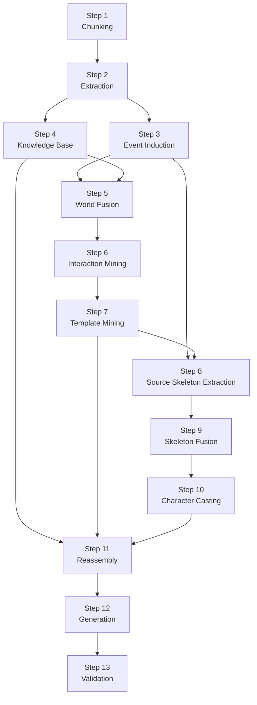

# PlotWeaver Pipeline

## Overview

PlotWeaver 现在使用一条 **13 步流水线** 来把输入小说从原始文本逐步转成最终分卷大纲。  
这条流水线的核心原则是：

1. 先保留细粒度信息，再逐层归纳。
2. `atom` 不是事件，多个 `atom` 会被连接成 `event`。
3. 模板服务于“事件内部的章节排布”，不是只做一句摘要。
4. 步骤文件只保留“本步骤的职责”，重复的文本处理和 JSON 读写下沉到公共模块。

## Directory Layout

### Step Modules

1. `pipeline/step1_chunking.py`
2. `pipeline/step2_extraction.py`
3. `pipeline/step3_event_induction.py`
4. `pipeline/step4_knowledge_base.py`
5. `pipeline/step5_world_fusion.py`
6. `pipeline/step6_interaction_mining.py`
7. `pipeline/step7_template_mining.py`
8. `pipeline/step8_skeleton_extraction.py`
9. `pipeline/step9_skeleton_fusion.py`
10. `pipeline/step10_character_casting.py`
11. `pipeline/step11_reassembly.py`
12. `pipeline/step12_generation.py`
13. `pipeline/step13_validation.py`

### Shared Modules (`pipeline/core/`)

- `pipeline/core/story_models.py`
  统一放 skeleton、character、relationship 相关的数据结构。
- `pipeline/core/world_building_core.py`
  统一放 `FusedWorld`、`KnowledgeBase`、世界快照保存加载、RAG 查询辅助。
- `pipeline/core/skeleton_core.py`
  统一放 skeleton 融合、角色 casting、多轮人物生成的公共逻辑。
- `pipeline/core/common_text.py`
  统一放文本扁平化、去重、文本规范化。
- `pipeline/core/common_json.py`
  统一放 JSON 清洗解析和通用文件读写。
- `pipeline/core/entity_aliasing.py`
  统一放实体匿名化、角色 key、地点别名映射。

## Flow Diagram

## Core Data Structures

### Step 1 Output

`NarrativeEvent`

- `event_id`
- `arc_name`
- `chapters`
- `summary`
- `chapter_start`
- `chapter_end`
- `subchunk_index`
- `subchunk_total`

`VolumeArc`

- `arc_name`
- `realm_start`
- `realm_end`
- `events`

### Step 2 Output

`PlotAtom`

- 原始轨：`raw_characters`、`character_keys`、`raw_location`、`raw_core_action`、`raw_summary`
- 匿名轨：`characters`、`location`、`core_action`、`summary`
- 逻辑字段：`motivation`、`conflict_type`、`narrative_function`、`emotion`、`tension_level`
- 因果字段：`causality_precondition`、`causality_consequence`

### Step 3 Output

`InducedEvent`

- `summary`
- `raw_summary`
- `conflict_hint`
- `function_hint`
- `source_atom_ids`
- `chapter_start`
- `chapter_end`
- `chapter_count`
- `characters`
- `raw_characters`
- `character_keys`

### Step 5 to Step 7 Output

`FusedWorld`

- 世界层：`world_name`、`world_background`、`power_source`、`global_theme`
- 力量层：`cultivation_realms`、`realm_dag`
- 模板层：`macro_tropes`、`plot_threads`、`micro_interactions`
- 排布层：`volume_templates`、`event_templates`、`role_slot_templates`、`event_flow_templates`

### Step 8 to Step 10 Output

`SkeletonNode`

- `node_id`
- `arc_name`
- `realm_level`
- `pacing_role`
- `original_summary`
- `conflict_hint`
- `function_hint`
- `role_slots`
- `template_hint`
- `chapter_count`
- `chapter_blueprint`
- `source_novels`

`NarrativeSkeleton`

- `base_novel`
- `nodes`
- `character_sheet`

### Step 11 Output

`ReassembledEvent`

- `event_id`
- `arc_name`
- `realm_level`
- `pacing_role`
- `adapted_summary`
- `used_trope`
- `template_name`
- `source_atom_ids`
- `event_plan`
- `active_characters`
- `state_updates`

### Step 12 Output

`VolumeOutline`

- `volume_number`
- `volume_title`
- `realm_range`
- `chapter_summaries`
- `tension_curve`
- `ending_state`

## Step-by-Step Explanation

### Step 1: Chunking

文件：`pipeline/step1_chunking.py`

职责：

- 读入输入目录的 `.txt` 小说。
- 按章节标题切分文本。
- 每 100 章形成一个 `VolumeArc`。
- 长章节允许切成多个子块，但仍保留章号和 `subchunk_index`。
- 把连续文本块重新合并成更适合后续抽取的 `NarrativeEvent`。

输入：

- 原始小说文本文件。

输出：

- `intermediate_data/step1_chunks.json`

说明：

- Step 1 不调用大模型。
- 这一层的目标是保留足够细粒度的信息，不提前把“多个章节组成的大事件”压扁。

### Step 2: Extraction

文件：`pipeline/step2_extraction.py`

职责：

- 对每个 `NarrativeEvent` 做两轮抽取。
- 第一轮抽客观要素：角色、地点、核心动作、修炼要素。
- 第二轮抽主观逻辑：动机、因果、冲突类型、叙事功能、情绪、张力。
- 同时建立 `raw + canonical + character_keys` 三层表示。

输入：

- Step 1 产生的 `VolumeArc -> NarrativeEvent`

输出：

- `intermediate_data/step2_extracted_plots.json`

说明：

- 这一步已经开始匿名化，但保留 `raw_*` 字段，避免长线被抹平。
- 后续模板提取主要依赖匿名轨和结构字段，长线关系依赖 `character_keys`。

### Step 3: Event Induction

文件：`pipeline/step3_event_induction.py`

职责：

- 把多个连续或相关的 `PlotAtom` 归并成更高层的 `InducedEvent`。
- 也就是把“atom 材料”连接成“事件单元”。
- 事件 closure 依据章节跨度、边界词、文本长度、下一段是否重启压力来决定。

输入：

- Step 2 的 `PlotAtom`

输出：

- `intermediate_data/step3_induced_events.json`

说明：

- 这一层解决的是“事件通常跨多个章节”的问题。
- 从这一层开始，后续的 skeleton、模板和排布不再直接对 atom 操作。

### Step 4: Knowledge Base

文件：`pipeline/step4_knowledge_base.py`

职责：

- 把 Step 2 的 atom 摘要放入 ChromaDB。
- 为后面的重组阶段提供事件级 RAG 检索。

输入：

- Step 2 的 `PlotAtom`

输出：

- ChromaDB `events` collection

说明：

- 这是“轻量 RAG”，检索对象是 atom 摘要，不是全量原文。
- 主要在 Step 11 重组时用来找相似事件和可借鉴的结构。

### Step 5: World Fusion

文件：`pipeline/step5_world_fusion.py`

职责：

- 从所有 atom 提取角色特征和突破机会。
- 融合统一的世界观、修炼体系和全局主题。
- 生成 `FusedWorld` 的世界基础部分。

输入：

- Step 2 的 `PlotAtom`
- Step 4 的 `KnowledgeBase`

输出：

- `intermediate_data/step5_world_fusion.json`

### Step 6: Interaction Mining

文件：`pipeline/step6_interaction_mining.py`

职责：

- 抽取可复用的 `micro_interactions`
- 抽取卷级 `macro_tropes`
- 抽取长线 `plot_threads`

输入：

- Step 2 的 `PlotAtom`
- Step 4 的 `KnowledgeBase`
- Step 5 的 `FusedWorld`

输出：

- `intermediate_data/step6_interaction_mining.json`

说明：

- 这一步的结果会被 Step 11 重组用来做“近期别重复”和“微模板建议”。

### Step 7: Template Mining

文件：`pipeline/step7_template_mining.py`

职责：

- 从 atoms 中提取：
  - `event_templates`
  - `volume_templates`
  - `event_flow_templates`
- `event_flow_templates` 是“事件内部章节排布模板”的来源。

输入：

- Step 2 的 `PlotAtom`
- Step 6 的 `FusedWorld`

输出：

- `intermediate_data/step7_template_mining.json`

说明：

- 这里的重点不是一句事件摘要，而是“这种事件通常几章、哪些功能必须覆盖、蓝图大致怎么排”。
- 章节功能允许重叠，不是死板的一章一个槽位。

### Step 8: Source Skeleton Extraction

文件：`pipeline/step8_skeleton_extraction.py`

职责：

- 从每本输入小说各自提取一套 source skeleton。
- 优先使用 Step 3 的 `InducedEvent`。
- 如果没有 induced events，才回退到原始 atom/event 聚簇。

输入：

- Step 1 的 `VolumeArc`
- Step 2 的 `PlotAtom`
- Step 3 的 `InducedEvent`
- Step 7 的模板化 `FusedWorld`

输出：

- `intermediate_data/step8_source_skeletons.json`

### Step 9: Skeleton Fusion

文件：`pipeline/step9_skeleton_fusion.py`

职责：

- 选一部参考小说作为 `base_novel` 控节奏。
- 但不是照抄它的 skeleton，而是把多本 source skeleton 融合成一个新骨架。
- 每个新节点会混合多个来源的 summary、role slots、blueprint 和 source novels。

输入：

- Step 1、2、3、7、8

输出：

- `intermediate_data/step9_skeleton.json`

说明：

- `base_novel` 只负责节奏基线，不应该变成唯一剧情来源。

### Step 10: Character Casting

文件：`pipeline/step10_character_casting.py`

职责：

- 基于 skeleton nodes 生成 `EventRolePlan`
- 分三层生成角色：
  - 核心人物
  - 卷级人物
  - 事件级人物
- 再生成关系网络

输入：

- Step 9 的 `NarrativeSkeleton`
- Step 7 的 `FusedWorld`

输出：

- `intermediate_data/step10_casted_skeleton.json`

说明：

- 这一步是“人物系统前置化”的关键，避免最后写大纲时只剩主角、师尊、宿敌几个人。

### Step 11: Reassembly

文件：`pipeline/step11_reassembly.py`

职责：

- 按 `plan -> candidates -> judge` 三段式重组事件。
- 给每个骨架事件先产出结构化计划，再并发生成多版本候选，再评审选优。
- 同时维护轻量状态账本：
  - relationships
  - resources
  - secrets
  - injuries
  - hooks

输入：

- Step 4 的 `KnowledgeBase`
- Step 7 的 `FusedWorld`
- Step 10 的 `NarrativeSkeleton + CharacterSheet`

输出：

- `intermediate_data/step11_reassembled_plot.json`

说明：

- 这是避免“模型一口气偷懒写整卷”的关键步骤。
- 这里也负责做重复抑制。

### Step 12: Generation

文件：`pipeline/step12_generation.py`

职责：

- 把 Step 11 的 `ReassembledEvent` 扩写成真正的卷级章节大纲。
- 仍然以事件为单位展开，但最终输出是 `VolumeOutline`。
- 章节数量参考事件计划里的 `target_chapter_count` 和 `chapter_blueprint`。

输入：

- Step 11 的 `ReassembledEvent`
- Step 10 的 `CharacterSheet`
- Step 7 的 `FusedWorld`

输出：

- `intermediate_data/step12_volume_outlines.json`

说明：

- 这里采用“软蓝图”而不是“逐 beat 硬编码”。
- 一章可以同时承担转折、代价和下一事件钩子。

### Step 13: Validation

文件：`pipeline/step13_validation.py`

职责：

- 对最终大纲做命名实体重合检查。
- 让模型做一次高层相似套路检查。
- 输出世界圣经、完整卷纲和验证报告。

输入：

- Step 12 的 `VolumeOutline`
- Step 11 的 `ReassembledEvent`
- Step 10 的 `NarrativeSkeleton`
- Step 7 的 `FusedWorld`
- 原始源文本

输出：

- `output/novel_world_bible.md`
- `output/volume_1_to_N_outline.md`
- `output/validation_report.md`

## Resume Files

| Step | Intermediate File |
|------|-------------------|
| 1 | `step1_chunks.json` |
| 2 | `step2_extracted_plots.json` |
| 3 | `step3_induced_events.json` |
| 5 | `step5_world_fusion.json` |
| 6 | `step6_interaction_mining.json` |
| 7 | `step7_template_mining.json` |
| 8 | `step8_source_skeletons.json` |
| 9 | `step9_skeleton.json` |
| 10 | `step10_casted_skeleton.json` |
| 11 | `step11_reassembled_plot.json` |
| 12 | `step12_volume_outlines.json` |

Step 4 使用的是 ChromaDB collection，不是单个 JSON 文件。

## What Is Intentionally Still Centralized

现在仍然偏大的文件主要有两个：

- `pipeline/core/world_building_core.py`
- `pipeline/core/skeleton_core.py`

这是刻意保留的，因为它们承担的是“跨多个步骤共享的领域核心逻辑”，不是步骤本身。

### `world_building_core.py`

集中放：

- `FusedWorld`
- `KnowledgeBase`
- world snapshot save/load
- role slot template library

### `skeleton_core.py`

集中放：

- skeleton 融合逻辑
- chapter blueprint fallback
- event role plan 构造
- 核心/卷级/事件级人物生成
- 关系网生成
- skeleton snapshot save/load

这两个文件可以以后继续细拆，但目前保留为 core 层是合理的，因为它们不是单一步骤脚本，而是多个步骤复用的共享核心。
